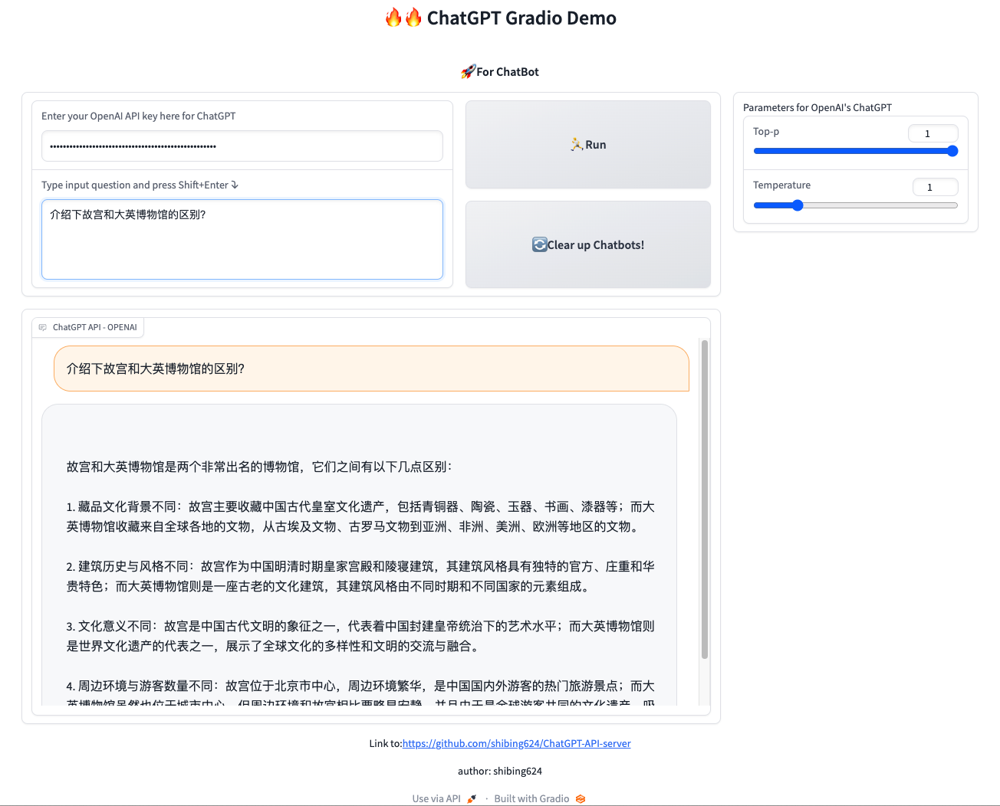

# ChatGPT-API-server
A python server for ChatGPT API.


## Features

- [x] **Text conversation**, text conversation chat function based on ChatGPT official API
- [x] **Multiple rounds of conversation**, supports multiple rounds of conversation, and can remember the conversation context
- [x] **Multi person conversation**, supports multi person conversations, and each person's conversation can maintain an independent context
- [x] **Customizing the expiration duration**, which allows you to customize the expiration duration of the conversation context

## Usage

### 1. OpenAI account registration

Go to [OpenAI Registration Page](https://beta.openai.com/signup) to create an account. For OpenAI Access denied Country, refer to this [tutorial](https://www.pythonthree.com/register-openai-chatgpt/) You can receive a verification code through a virtual phone number.
After creating an account, go to the [API Management Page](https://beta.openai.com/account/api-keys) create an API Key and save it. Later, you need to configure this key in the project.

### 2. Install dependencies

```bash
pip install -r requirements.txt
```

### 3. Run API server
```bash
python chatgpt_api.py
```

## Deploy

### Deploy on Gradio

[](https://huggingface.co/spaces/shibing624/ChatGPT-API-server)



run example: [gradio_server.py](gradio_server.py) to see the demo:
```shell
python gradio_server.py
```

# Citation

BibTeX:
```latex
@misc{Xu_ChatGPT-API-server,
  title={ChatGPT-API-server: ChatGPT API server},
  author={Xu Ming},
  year={2023},
  howpublished={\url{https://github.com/shibing624/ChatGPT-API-server}},
}
```

## License

**Apache License 2.0**

## Contribute

The project code is still very rough. If you have any improvements to the code, please submit it back to this project. 
Before submitting `PR`, please note the following two points:

- Add corresponding unit tests in 'tests'
- Use 'python - m pytest' to run all unit tests to ensure that all single tests pass


## Reference

* [acheong08/ChatGPT](https://github.com/acheong08/ChatGPT)
* [zhayujie/chatgpt-on-wechat](https://github.com/zhayujie/chatgpt-on-wechat)
